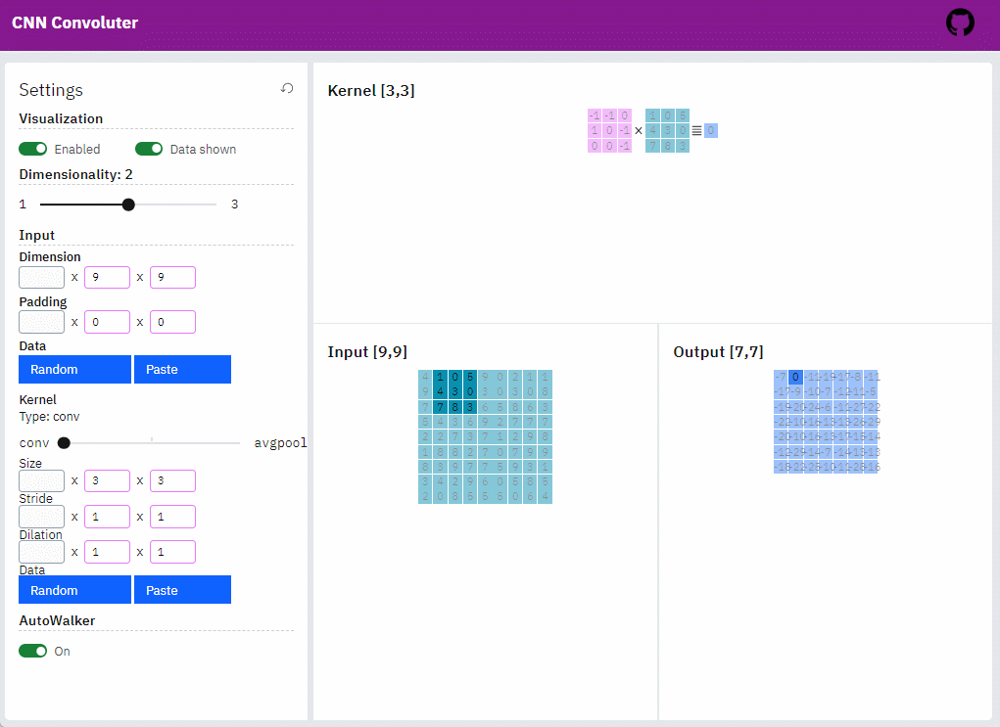

# cnn-convoluter

An interactive player for CNN convolution

https://pwwang.github.io/cnn-convoluter/



## Building your own version
```shell
# clone this repo
npm run build
```

## Implementation

- React
- Bootstrap

## Todos

- [ ] Probable optimizations for React usage (This is my first react app)
- [ ] 3D visualization support (need to find a good but simple 3D engine)
- [ ] Transposed convolution?
- [ ] Pooling layers/Activation?
- [ ] Loading data?
